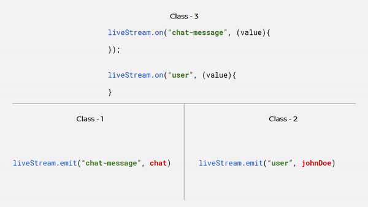

# LiveStream - Flutter 

[](https://pub.dartlang.org/packages/livestream)


<p align="center">
  
</p>

LiveStream is a data holder class which can observe change of data in real-time and emit values too. Here's emitter subscriber pattern. It's developed in pure Dart.

## ⚡️ Getting Started

### Add Dependency
Add below dependency in [`pubspec.yaml`](pubspec.yaml).

```yml
dependencies:
  livestream: ^1.0.0
```

### Initialize `LiveStream` Instance
You can create instance as below.

```dart
  LiveStream liveStream = new LiveStream();
```

### Subscribe to Stream / Add Observer
`LiveStream` event will be dispatched when data is changed. See below code to add observer / subscriber.

```dart
    liveStream.on("chat-message", (message) {
      print("Message Received: $message");
    });
```
Whenever data is emitted to `chat-message` channel/stream above block will be executed.

### Emitting Events or Broadcasting
The main idea behind `LiveStream` is that you can send and receive any events you want, with any data you want. Any objects that can be encoded as JSON will do, and binary data is supported too. See code below.

```dart
  void send() {
      String message = "Hi there!";
      liveStream.emit("chat-message", message);
  }
```

## 🚀 Sample Usage
Sample code is available in [`/example`](/example) directory. 

## 🤝 Contribute
If you want to contribute to this library, you're always welcome!
See [Contributing Guidelines](CONTRIBUTING.md). 

## ✉️ Contact
If you need any help, you can connect with me.

Visit:- [shreyaspatil.dev](https://shreyaspatil.dev)

## 📃 License
```
MIT License

Copyright (c) 2020 Shreyas Patil

Permission is hereby granted, free of charge, to any person obtaining a copy
of this software and associated documentation files (the "Software"), to deal
in the Software without restriction, including without limitation the rights
to use, copy, modify, merge, publish, distribute, sublicense, and/or sell
copies of the Software, and to permit persons to whom the Software is
furnished to do so, subject to the following conditions:

The above copyright notice and this permission notice shall be included in all
copies or substantial portions of the Software.

THE SOFTWARE IS PROVIDED "AS IS", WITHOUT WARRANTY OF ANY KIND, EXPRESS OR
IMPLIED, INCLUDING BUT NOT LIMITED TO THE WARRANTIES OF MERCHANTABILITY,
FITNESS FOR A PARTICULAR PURPOSE AND NONINFRINGEMENT. IN NO EVENT SHALL THE
AUTHORS OR COPYRIGHT HOLDERS BE LIABLE FOR ANY CLAIM, DAMAGES OR OTHER
LIABILITY, WHETHER IN AN ACTION OF CONTRACT, TORT OR OTHERWISE, ARISING FROM,
OUT OF OR IN CONNECTION WITH THE SOFTWARE OR THE USE OR OTHER DEALINGS IN THE
SOFTWARE.
```
